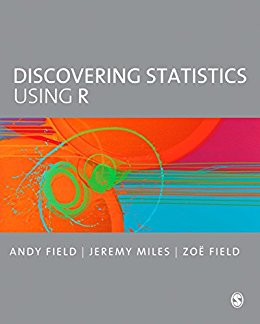

```{r setup, include=FALSE}
options(htmltools.dir.version = FALSE)
library(tidyverse)
```

# The five verbs of dplyr

|Function |Effect|
|------------|----|
| filter()   |Include or exclude observations (rows)|
| select()   |Include or exclude variables (columns)|
| mutate()   |Create new variables (columns)|
| summarise()|Aggregate or summarise groups of observations (rows)|
| arrange()  |Change the order of observations (rows)|

---
# Importing, transforming, and summarising your data

```{r import-crime, message = FALSE}
library(readr)
crime <- read_csv("data/crime.csv")
crime
```


---
# Importing, transforming, and summarising your data

```{r pris-pop}
library(readxl)
prison_pop <- read_excel("data/prison-population-data-tool-31-december-2017.xlsx",
                         sheet = "PT Data")
filter(prison_pop,
       View == "a Establishment*Sex*Age Group", Date == "2017-09") %>%
  group_by(Sex) %>%
  summarise(mean_pop = mean(Population, na.rm = TRUE),
            median_pop = median(Population, na.rm = TRUE),
            max_population = max(Population, na.rm = TRUE))
```

---
# Importing, transforming, and summarising your data

```{r summ-crime}
grouped_crime <- group_by(crime, sex, victim_crime)
summarise(grouped_crime,
          state_anxiety = mean(SA),
          sd_SA = sd(SA),
          var_SA = var(SA))
```

---
# Things we've covered

1.  How to structure data through data.frames

2.  How to handle different types of data (characters, numbers, logicals)

3.  How to import different types of data

4.  How to visualize your data

5.  How to select only the data you need

6.  How to summarise data

---
class: inverse, center, middle
# You've come a long way!


---
class: inverse, center, middle
# Some R (and beyond) tips

---
background-image: url(images/06/composite-orly.png)
background-size: contain

---
background-image: url(images/06/google.png)
background-size: contain

---
# Some notes about Discovering Statistics Using R

.pull-left[

]
.pull-right[
1.  Great as a *reference* book for stats. If you want to know more about the underlying maths or rationale of a given test, you'll find it in here.

2. If you don't know how to do a particular test, or what test you need, find it in here. 

3.  The coding style I've taught you differs. Both styles are fine.

4.  There is no need to read it cover to cover.
]

---
class: center, middle, inverse
# The who, what and how of research 

---
# Research questions

.large[
In research, you typically want to ask questions like

- Do people find object recognition easier if the picture is in colour or in black and white?

- Is the blue pill or red pill better for treating a cold?

- Are people with higher anxiety more likely to have depression?

How do we measure, compare, and assess the phenomena we talk about?
]

---
# Operationalizing your variables

We often don't have direct access to the *underlying*, *psychological* phenomena. Thus, we need to define how to measure them. 

For example, [Ellis & Renouf (2018)](https://doi.org/10.1080/14789949.2017.1410562) used scales like the HEXACO-PI-R, or the State-Trait Anxiety Inventory.

.pull-left[
```{r crime-hexa}
head(select(crime, H:O), 6)
```
]
.pull-right[
```{r crime-foc}
head(select(crime, FoC, Foc2), 6)
```
]

---
# The Fear of Crime dataset

.pull-left[
Some of the fundamental research questions for the Fear of Crime experiment [Ellis & Renouf (2018)](https://doi.org/10.1080/14789949.2017.1410562) were: 

1.  Do men and women differ in terms of their fear of crime?

2.  Are people who have been a victim of crime more fearful of crime?

So who did they collect data from?
]
.pull-right[
```{r sel-crim}
select(crime, sex, victim_crime, FoC)
```
]

---
# Populations and samples

.pull-left[
A *population* is all the members of a defined group (e.g. all people with anxiety-related disorders; all black and white objects).

For the question "Are people who have been a victim of crime more fearful of crime than people who have not been a victim of crime?", you have two potential *populations*: people who have and people who have not been a victim of crime.

We rarely have the capability to get statistics for an entire population. Thus, we draw *samples* and try to estimate *population* values.
]

.pull-right[
```{r crime-pop2}
crime %>%
  group_by(victim_crime) %>%
  summarise(n())
```
]

---
# Populations and samples

.pull-left[
Our question was not just about whether there are people who have and people who haven't been victims of crime.

Our dependent variable is the *fear of crime*.

A starting question would be what are the potential values of the *fear of crime* if the population was simply *everyone*? 

We can get an idea by plotting the *sampling distribution* - the distribution of values for our entire sample.
```{r crim-histo, fig.height = 5, fig.show = "hide"}
ggplot(crime, aes(x = FoC)) +
  geom_histogram(binwidth = 0.25) + theme_classic()
```
]
.pull-right[
`)
]

---
# Populations and samples

.pull-left[
Our next question is: does the data we have collected support the idea that victims of crime are a separate population from non-victims, with respect to *fear of crime*?

As we can see, the distributions of our two samples overlap substantially.

This suggests that, at least with respect to *fear of crime*, all our participants may be part of *one population*. But we need to follow this up with statistics!

```{r crim-facet, fig.height = 5, fig.show = "hide"}
ggplot(crime, aes(x = FoC, fill = victim_crime)) +
  geom_histogram(binwidth = 0.25,
                 position = "dodge") + 
  scale_fill_brewer(palette = "Dark2") +
  theme_classic()
```
]
.pull-right[
`)
]

---
class: inverse, center, middle
# Comparing two samples

---
# Descriptive statistics

.pull-left[
We want to estimate what values are *typical* or *characteristic* of a given population from samples.

Then we want to be able to distinguish between different *populations*.

There are a range of different statistics we can calculate that will help describe our samples.

The most obvious statistic to calculate is the *mean*, and its close friend, the *standard deviation* - **sd()**.

]
.pull-right[
```{r FoC-crim, warning = FALSE}
crime %>%
  group_by(victim_crime) %>%
  summarise(n(),
            mean(FoC),
            std.dev = sd(FoC))
```
]

---
# Descriptive statistics 

.pull-left[
The mean and standard deviation describe the characteristics of our samples.

But remember that these are samples from potential populations. So one question is how precisely our sample captures the true mean value of the *population*.

For that, we need the *standard error of the mean* (or SEM). 

The SEM is the *standard deviation* divided by the *square root* - **sqrt()** - of the sample size.
]
.pull-right[
```{r FoC-crim-more, warning = FALSE}
crime %>%
  group_by(victim_crime) %>%
  summarise(n = n(),
            mu = mean(FoC),
            std = sd(FoC),
            sem = std/sqrt(n))
```
]

---
# Descriptive statistics  

.pull-left[The SEM gives us a measure of how well we've estimated the population mean from our sample. An easy way to visualize this is with error bars.

Here I add a **stat_summary()** to a **ggplot()**.

The large overlap between the error bars tells us that, at least with these samples, we have little evidence that there is a difference in Fear of Crime between these two groups.
]
.pull-right[
```{r error-bars, fig.height=5}
ggplot(crime, aes(x = victim_crime, y = FoC)) + 
  stat_summary(fun.data = mean_se) + 
  theme_classic()
```
]

---
class: inverse, center, middle
# Null Hypothesis Significance Testing

---
# Null Hypothesis Significance Testing (NHST)

Think back to our original questions:

1.  Do men and women differ in terms of their fear of crime?

2.  Are people who have been a victim of crime more fearful of crime?

The basis of NHST is to phrase these questions as: 

If there is only one population, how likely is it that our two samples have values this different from each other?

We answer this question with *test statistics* and *p-values*.

---
# The *t*-test family

.pull-left[

The statistical test of choice for comparing two means is the *t*-test.

1.  One-sample t-tests
    - Compares one sample of means to a specific value (e.g. 0)
2.  Independent t-tests
    - Compares means across different groups (e.g. groups of people)
3.  Paired t-tests
    - Compares means across related data (e.g. data from the same people measured twice)
    
We use the **t.test()** function for all of these!
]
.pull-right[
```{r error-bars-again, fig.height=5, echo = FALSE}
ggplot(crime, aes(x = victim_crime,
                  y = FoC)) + 
  stat_summary(fun.data = mean_se) + 
  theme_classic()
```
]

---
# Performing *t*-tests in R

Let's test whether the mean Fear of Crime differs between victims of crime and non-victims.

Victims and non-victims are two independent groups, so we need an independent (or two-sample t-test).

```{r inital-test}
t.test(FoC ~ victim_crime, data = crime, paired = FALSE)
```

---
# Performing *t*-tests in R

.pull-left[
The tilde (~) symbol in R usually means "modelled by" 

`FoC ~ victim_crime` means `FoC modelled by victim_crime`.

`data = crime` tells R to look in the `crime` data frame for the data.

`paired = FALSE` tells R that this is an *independent samples* test. 

]
.pull-right[
```{r inital-t}
t.test(FoC ~ victim_crime,
       data = crime,
       paired = FALSE)
```
]

---
# Performing *t*-tests in R

.pull-left[
The output shows the key statistics in one-line:

t = 0.46069, df = 299, p-value = 0.6454

The p-value is above .05, so there was no significant difference in fear of crime between people who were victims and people who were not.

**Reminder:** a p-value is the probability of obtaining this difference between means if the null hypothesis is true.

There are also *sample estimates*, i.e. the group means, and confidence intervals of the *difference* between means.
]
.pull-right[
```{r inital-t-two, echo = FALSE}
t.test(FoC ~ victim_crime,
       data = crime,
       paired = FALSE)
```
]

---
# Performing *t*-tests in R

.pull-left[
None of the measures in the `crime` dataset are *repeated* or *paired*, so for a moment we need to switch to another dataset.

`crossmod` is a dataset from a cognitive experiment in which participants identified objects using by touch. They did this twice. Sometimes the objects changed size; sometimes they stayed the same. The hypothesis was that changing size would slow down naming.
]
.pull-right[
```{r crossmod-check, message = FALSE}
crossmod <- read_csv("data/crossmod.csv")
crossmod
```
]

---
# Performing *t*-tests in R

Since the data contains repeated measurements from the same participants, we need to run a paired/repeated-measures t-test. So we simply change `paired = FALSE` to `paired = TRUE`!

```{r}
t.test(RT ~ Size, data = crossmod, paired = TRUE)
```


---
class: inverse, center, middle
# Checking assumptions

---
# Assumptions of the *t*-test

.large[
Before we get too carried away with our results, we have to check our assumptions!

1.  The dependent variable must be continuous (and *interval* or *ratio*).

2.  The independent variable must be categorical.

3.  The distribution of data for each sample should be approximately normal.

## Independent t-tests have a couple of extra assumptions:

4.  The data in each sample should be *independent* (i.e. come from different people)

5.  The variance of the data in each group should be the same (*Homogeneity of variance*).
]

---
class: inverse, center, middle
# Levels of measurement
---
background-image: url(images/04/100m_results.jpg)
background-size: contain
class: inverse


---
background-image: url(images/04/100m_results_focus.jpg)
background-size: 45%
background-position: 90% 45%
# Levels of measurement
.pull-left[ 
## Nominal data

Nominal data is categorical data that has no natural order. 

For example, the runners' names (e.g. Usain Bolt, Asafa Powell, Tyson Gay) and nationalities (e.g. Jamaica, USA) are **nominal**.
]
---
background-image: url(images/04/100m_results_focus.jpg)
background-size: 45%
background-position: 90% 45%
# Levels of measurement
.pull-left[
## Ordinal data

Ordinal data is also categorical, but is *ordered*. The gaps between the categories are not necessarily equal.

e.g. finishing position is ordinal, but the gap between first and second is bigger than the gap between second and third!
]

---
background-image: url(images/04/100m_results_focus.jpg)
background-size: 45%
background-position: 90% 45%
# Levels of measurement
.pull-left[
## Interval data

Interval data is data with equally spaced intervals. (e.g. the gap between 9 seconds and 10 seconds is the same as the gap between 12 seconds and 13 seconds)

## Ratio data

Ratio data is similar to interval data, but has a meaningful boundary at zero (e.g. a finishing time cannot be below zero.)
]

---
background-image: url(images/06/paranormal.png)
background-position: 50% 75%
background-size: 15%
class: inverse, middle, center
# The assumption of *normality*

---
# The assumption of *normality*

.pull-left[
A normal distribution can be easily described by two parameters: the mean - $\mu$ - and the standard deviation - $\sigma$.

The normal distribution is approximately symetrically distributed about its central values. 

For example, Mean Intelligence Quotient is 100; the standard deviation is 15. Thus, it's easy to draw what the distribution of IQ looks like in the general population.
]
.pull-right[
```{r hypothetical-norm, echo = FALSE, fig.height = 5}
tibble(iq = 0:200,
       density = dnorm(iq, mean = 100, sd = 15)) %>%
  ggplot(aes(x = iq, y = density)) +
  geom_line() +
  theme_classic() +
  geom_vline(xintercept = 100, linetype = "dashed") +
  geom_vline(xintercept = c(85, 115), linetype = "dotted") +
  annotate(geom = "text", x = 150, y = 0.025, label = "Mean = 100") +
  annotate(geom = "text", x = 150, y = 0.0235, label = "Standard deviation = 15")
```
]

---
# Checking normality
.pull-left[
Plotting our data is a simple way to check normality!

Our data are clearly *skewed* - more values are to the left than to the right.

```{r check-dist, fig.height = 5, fig.show= "hide"}
ggplot(crime, aes(x = FoC,
                  fill= victim_crime)) +
  geom_density(alpha = 0.5) + 
  theme_classic()
```
If you need to test normality formally, use the Shapiro-Wilks test - **shapiro.test()**.
]
.pull-right[
`)
]

---
# Checking normality

.pull-left[
With a repeated-measures design, we care about the normality of the *differences* between pairs.

```{r spread-crossmod}
crossmod_wide <- 
  crossmod %>% 
  spread(Size, RT) %>%
  mutate(size_diff = DS - SS)
```

```{r rep-meas-diff, fig.show = "hide", fig.height = 5}
ggplot(crossmod_wide,
       aes(x = size_diff)) +
  geom_histogram(alpha = 0.5) + 
  theme_classic()
```
]

.pull-right[
`)
]


---
# Checking normality

.pull-left[

This looks a little suspicious. There's probably an *outlier* at the far right side of the plot (more on these next session).

```{r shap-test}
shapiro.test(crossmod_wide$size_diff)
```

The Shapiro-Wilks test suggests that normality is violated.

]
.pull-right[
`)
]

---
class: inverse, middle, center
# Homogeneity of variance

---
# Homogeneity of variance

.pull-left[
Remember how a normal distribution can be described by two parameters: the mean and the standard deviation.

As we increase the mean, the distribution shifts further along the x-axis (or vice versa!)

With a *t*-test we only want to pick up differences in the location of the *means* along the x-axis representing our dependent variable.


]
.pull-right[
```{r hypothetical-norm-rep, echo = FALSE, fig.height = 5}
tibble(iq = 0:200,
       hundred = dnorm(iq, mean = 100, sd = 15),
       hundred20 = dnorm(iq, mean = 120, sd = 15)) %>%
  gather(mu, density, -iq) %>%
  ggplot(aes(x = iq, y = density)) +
  geom_line(aes(group = mu, linetype = mu)) +
  theme_classic() 
```
]

---
# Homogeneity of variance

.pull-left[
Our ability to detect differences in the location of the means is hampered if the *standard deviation* (or the *variance*, which is sd^2) differs across groups.

As the standard deviation increases, the variability around the mean increases, and the distribution of values gets *broader*.

Here, I doubled the standard deviation of the second distribution to 30.

Differences in variance across groups can *bias* your statistics in complex ways.

]
.pull-right[
```{r hypothetical-norm-two, echo = FALSE, fig.height = 5}
tibble(iq = 0:200,
       thin = dnorm(iq, mean = 100, sd = 15),
       fat = dnorm(iq, mean = 120, sd = 30)) %>%
  gather(dist_type, density, -iq) %>%
  ggplot(aes(x = iq, y = density)) +
  geom_line(aes(group = dist_type, linetype = dist_type)) +
  theme_classic() 
```
]

---
# Homogeneity of variance

.pull-left[
Let's look again at our distributions for Fear of Crime.

Although they're skewed, it looks like they're similarly variable.

We can test this statistically using Levene's test from the **car** package:
```{r warning = FALSE}
library(car)
leveneTest(FoC ~ victim_crime, data = crime)
```

It's not significant, consistent with our visual impressions.

]
.pull-right[
```{r homg-var, fig.height = 5, echo = FALSE}
ggplot(crime, aes(x = FoC,
                  fill = victim_crime)) + 
  geom_density(alpha = 0.5) +
  theme_classic()
```
]

---
# The assumption of independence

From the `crossmod` dataset, RTs across the two conditions have a strong positive relationship. 

Values generated by the same people on repeated occassions tend to be correlated.

```{r echo = FALSE, fig.height = 5}
crossmod %>% 
  spread(Size, RT) %>%
ggplot(aes(x = SS, y = DS)) +
  geom_point() +
  stat_smooth(method = "lm") + 
  theme_classic()
```

---
class: inverse, middle, center
# What to do about violated assumptions

---
# What to do about violated assumptions

1.  When homogeneity of variance is violated
    - Welch's t-test does not assume equality/homogeneity of variance. 
    By default, R uses Welch's t-test for independent samples.
    - This is only a problem for independent samples t-tests.

2.  When independence is violated
    - Use a paired or repeated-measures t-test.

3.  When normality is violated
    - Often...nothing is done, or the data is *transformed*. But see next slide...

---
# What to do about violated assumptions

Consider using non-parametric statistics, which make fewer assumptions.

The most frequently used tests are the Wilcoxon rank-sum test (sometimes called the Mann-Whitney U test) for independent samples data, and the Wilcoxon signed-rank test for paired samples data.

Simply substitute *t.test()* for *wilcox.test()*!

```{r wilco}
wilcox.test(FoC ~ victim_crime, data = crime, paired = FALSE)
```

---
# Reporting the results of a *t*-test

.pull-left[
```{r message = FALSE}
t.test(FoC ~ victim_crime, data = crime)
```
]

.pull-right[
```{r}
crime %>% 
  group_by(victim_crime) %>%
  summarise(means = mean(FoC),
            sem = sd(FoC) / sqrt(n()))
```
]

---
# Reporting the results of a *t*-test

Report to TWO decimal places, typically. 

"On average, victims of crime participants did not have significanly higher Fear of Crime (*M* = 2.41, *SE* = .10) than male participants (*M* = 2.46, *SE* = .07), 
*t*(197.48) = .453, *p* = .65."

Exact *p-values* should be reported down to three decimal places; if the p-value is below .001, report "*p* < .001".

Remember to specify, *somewhere*, what type of *t*-test you used.

(for further guidance, see Field et al, Discovering statistics using R)

---
# A plotting suggestion

.pull-left[
One way to compare distributions is graphically.

Here we plot the data from each sample using boxplots, with individual data overlaid as points.

Each point is the score for an individual. 

```{r box-crim, fig.height = 5, fig.show = "hide", warning = FALSE}
crime %>% 
  ggplot(aes(x = victim_crime, y = FoC)) + 
  geom_jitter(width = 0.05, alpha = 0.5) +
  geom_boxplot(alpha = 0.5) +
  theme_classic() +
  labs(y = "Fear of crime", x = "Victim of crime")
```
]
.pull-right[
`)
]

---
# Next session

Enjoy next week's reading week...!

The week after that we'll look into **regression** and **correlation**.

Chapters 6 (Correlation) and 7 (Regression) of Discovering Statistics Using R.

## Reminder - don't feel you have to read every word!

Look at the introductory sections of each chapter, refer back to the rest *as necessary*.

---
class: title-slide-final, middle, inverse
background-image: url('images/University of Lincoln_logo_General White Landscape.png')
background-size: 500px
background-position: 50% 10%

