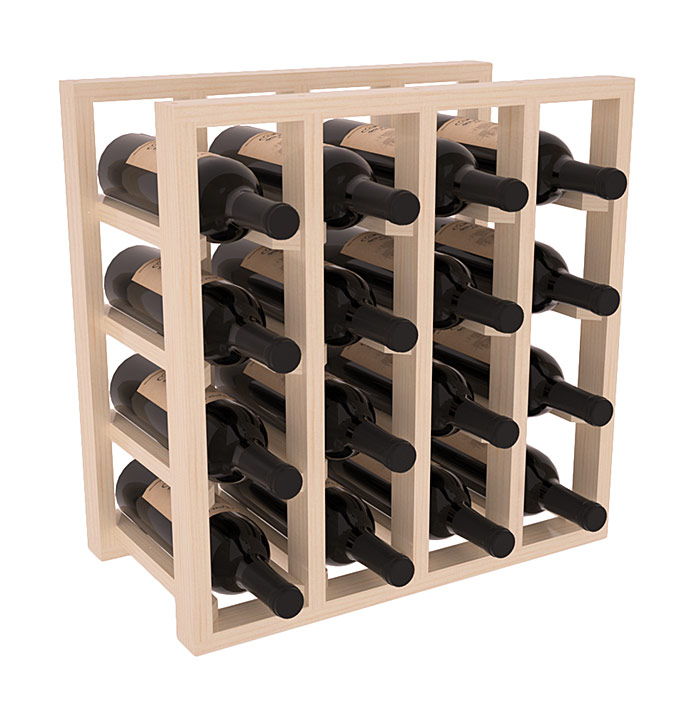
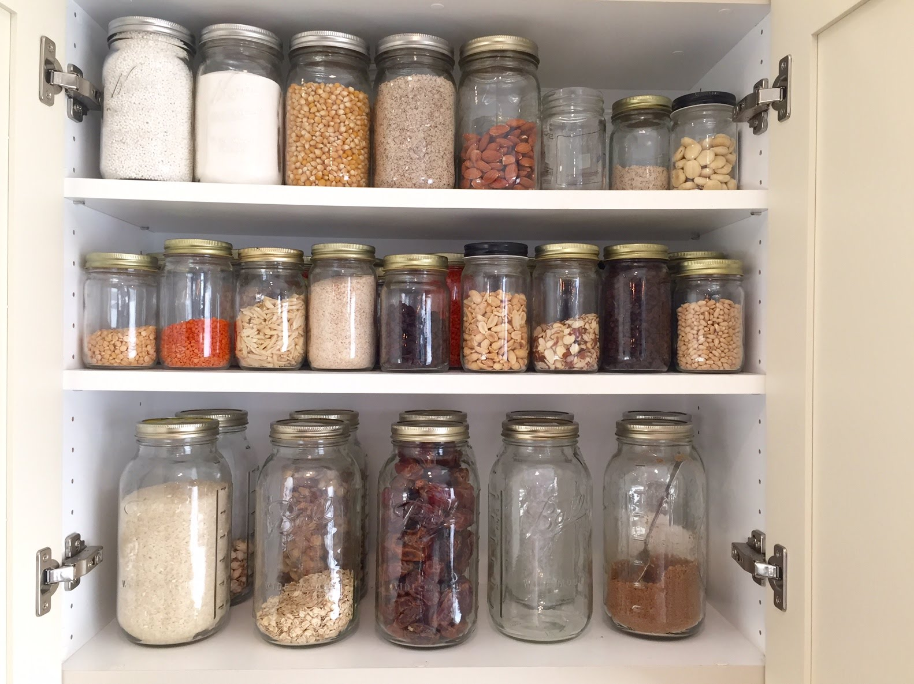

```{r setup, include=FALSE}
options(htmltools.dir.version = FALSE)
library(tidyverse)
```

```{r echo = FALSE}
example_rt_df <- 
  data.frame(Participant = rep(1:10,
                               each = 10),
             Viewpoint = c("Same", "Different"),
             B1RT = rnorm(20, 500, 100),
             B2RT = rnorm(20, 400, 100)) %>% group_by(Participant, Viewpoint) %>% summarise(B1RT = mean(B1RT), B2RT = mean(B2RT))
```

# Writing R Scripts

Scripts are text documents that contain a sequence of commands to be executed sequentially.

A typical script looks something like this:
```{r eval = FALSE}
# Load in required packages using library()
library(tidyverse)

# Define any custom functions here (we haven't covered this!)

# Now load any data you want to work on. (again, we'll cover this later!)
test_data <- 
  read_csv("data/a-random-RT-file.csv") %>% # I'll explain what %>% means later
  rename(RT = `reaction times`)

# The rest of the script then runs whatever analyses or plotting you want to do
ggplot(test_data,
       aes(x = RT,
           fill = viewpoint)) + 
  geom_density()
```

---
background-image: url(images/02/cloud-rmd-example.png)
background-position: 65% 85% 
background-size: 50%
# RMarkdown

.large[
RMarkdown documents contain a mixture of code and plain text.

They can be used to produce *reports* and fully formatted documents with whatever structure you choose.
]

---
# Basic data types

There are five basic data types in R:

```{r echo=FALSE}
examps <- data.frame(Type = c("integer", "numeric",
                              "character", "logical",
                              "complex"),
           Description = c("Whole numbers",
                           "Any real number, fractions",
                           "Text",
                           "Assertion of truth/falsity",
                           "Real and imaginary numbers"),
           Examples = c( "1, 2, 3",
                         "3.4, 2, -2.3",
                         "\"Hi there\", \"8.5\", \"ABC123\"",
                         "TRUE, FALSE",
                         complex(real =.34, imaginary = 5.3)))
knitr::kable(examps, format = "html")
```

---
# Containers

**Vectors** are one-dimensional collections of values of the same basic data type.

**Matrices** are two-dimensional collections of values of the same basic data type.

**Lists** are collections of objects of varying length and type.

**Data frames** are tables of data.

.pull-left[

]
.pull-right[

]

---
# Accessing elements from containers

You can use the **[]** operator after the name of an object to extract indvidual elements from that object.

```{r echo = FALSE}
album_list <-
  list(The_Beatles = c(
    "Sgt. Pepper",
    "The White Album",
    "Revolver",
    "Abbey Road"),
    Nirvana = c(
      "Bleach",
      "Nevermind",
      "In Utero")
    )
test_matrix <- matrix(rnorm(9), nrow = 3, ncol = 3)
char_example <- c("Monday", "Tuesday", "Wednesday", "Thursday")
one_to_four <- 1:4
names(one_to_four) <- char_example
```
.pull-left[
```{r}
one_to_four
test_matrix
```
]
.pull-right[
```{r}
one_to_four["Wednesday"]
test_matrix[2:3, 1:2]
```
]

---
class: inverse, center, middle

# Join the RStudio.cloud class workspace!
#http://bit.ly/PSYWorkspace


---
background-image: url(images/03/tidy-hex.png)
background-position: 50% 75%
background-size: 50%
class: inverse, middle, center

---
background-image: url(images/03/tidy-hex.png)
background-position: 90% 5%
background-size: 8%

# Tidyverse 

.large[
The **tidyverse** is a collection of packages that expand R's functions in a structured, coherent way.

```{r eval = FALSE}
install.packages("tidyverse")
```
]
.large[
There are eight core **tidyverse** packages loaded using **library(tidyverse)**.

.pull-left[
* ggplot2
* **tidyr**
* dplyr
* **tibble**
]
.pull-right[
* purrr
* readr
* stringr
* forcats
]
]

---
background-image: url(images/03/tidy-hex.png)
background-position: 90% 5%
background-size: 8%

# Tidyverse

.large[
You can load all these packages at once.
]

```{r eval = FALSE}
library(tidyverse) # This loads all the tidyverse packages at once
```

.large[
You can also load each one individually. We'll be using the **tibble** package next.
]

```{r eval = FALSE}
library(tibble)
```

.large[Many of the *tidyverse* packages create or output *tibbles*, which are essentially a more user-friendly version of data frames.]

---
# Tibbles

You can create a *tibble* similarly to how you create a data frame, using **tibble()**.

```{r}
age_tibb <- 
  tibble(Participant = 1:10, 
       cond1 = rnorm(10),
       age_group = rep(c("Old", "Young"), each = 5))
head(age_tibb)
```

---
# Tibbles
```{r eval = FALSE}
age_tibb <- 
  tibble(Participant = 1:10, 
       cond1 = rnorm(10),
*       age_group = rep(c("Old", "Young"), each = 5))
```

Here I used the **rep()** function to generate a character vector with the values "Old" and "Young".

```{r}
rep(c("Old", "Young"), each = 5)
rep(c("Old", "Young"), 5)
```

---
class: inverse, center, middle
# Relating data to structure

---
# Let's think about an *experiment*

.large[
The experiment is a reaction time experiment with a two-by-two repeated measures design.

Participants see pictures of objects twice. Sometimes they are seen from the *same* viewpoint twice, sometimes from *different* viewpoints each time. 

There are two separate blocks of trials. 
The dependent variable is how long it takes them to name the objects, or *reaction time*.

You're interested in whether:

1. they get faster at naming object the second time

2. they are faster when the same view is presented both times.
]

---
# How many variables are there?

|Variables| R Data Type|
|--------------|------------|
|Participant ID|Numeric or character|
|Reaction times|Numeric|
|Block first/second|Character/factor|
|Viewpoint same/different|Character/factor|

.large[
The final dataset needs to be able to do several things.

1. It needs to uniquely identify each participant.

2. It needs to tie each value to the right participant.

3. It needs to identify what each value represents in terms of the design.
]

---
class: inverse, center, middle
# The many ways to structure data

---
# One column for condition, one column for RT
.pull-left[
```{r echo = FALSE}
set.seed(200)
example_rt_df <- 
  data.frame(Participant = rep(1:10,
                               each = 40),
             exp_condition = rep(c("Block1_same",
                                   "Block2_same",
                                   "Block1_different",
                                   "Block2_different"),
                                 each = 10),
             RT = rnorm(400, 400, 100)) %>%
  group_by(Participant, exp_condition) %>%
  summarise(RT = mean(RT))
example_rt_df
```
]
.pull-right[
.large[
This is a little awkward.

At first glance, there's no easy way to see how many variables there.
]
]
---
# Dependent variable split across columns

.pull-left[
```{r echo = FALSE}
set.seed(200)
example_rt_df <- 
  data.frame(Participant = rep(1:10,
                               each = 10),
             Viewpoint = c("Same", "Different"),
             B1RT = rnorm(20, 500, 100),
             B2RT = rnorm(20, 400, 100)) %>%
  group_by(Participant, Viewpoint) %>%
  summarise(B1RT = mean(B1RT), B2RT = mean(B2RT))
head(example_rt_df, 16)
```
]

---
# One column per condition
```{r echo = FALSE}
set.seed(200)
example_rt_df <- 
  tibble(Participant = rep(1:10,
                               each = 10),
             Block1_same = rnorm(100, 500, 100),
             Block2_same = rnorm(100, 300, 100),
             Block1_different = rnorm(100, 550, 100),
             Block2_different = rnorm(100, 400, 100)) %>%
  group_by(Participant) %>%
  summarise_all(mean)

example_rt_df
```

.large[
This is also called **wide** format.
]

---
# How many *variables* are there?

```{r echo = FALSE}
example_rt_df
```

--
Four... but there are five columns.

```{r}
ncol(example_rt_df)
```

---
# How many *observations* are there?

```{r echo = FALSE}
example_rt_df
```

--
40... but there are 10 rows.

```{r}
nrow(example_rt_df)
```

---
# Your target

Switch to RStudio.cloud and open the "Week 3 - Structuring Data" Project. 

```{r echo = FALSE}
set.seed(200)
example_rt_df <- 
  tibble(Participant = seq(1, 10),
             Block1_same = rnorm(10, 500, 100),
             Block2_same = rnorm(10, 350, 100),
             Block1_different = rnorm(10, 500, 100),
             Block2_different = rnorm(10, 400, 100))
example_rt_df
```

---
# A possible solution

```{r examp-df}
set.seed(200) # if you want these exact numbers, use this line
example_rt_df <- 
  tibble(Participant = seq(1, 10),
         Block1_same = rnorm(10, 500, 100),
         Block2_same = rnorm(10, 350, 100),
         Block1_different = rnorm(10, 500, 100),
         Block2_different = rnorm(10, 400, 100))
```
```{r echo = FALSE}
head(example_rt_df, 5)
```
---
class: inverse, center, middle
# Tidy data

---
background-image: url(images/03/tidy-1.png)
background-position: 50% 65%
background-size: 75%
# The three principles of tidy data

1.  Each variable must have its own column.

2.  Each observation must have its own row.

3.  Each value must have its own cell.

---
background-image: url(images/03/tidy-1.png)
background-position: 50% 80%
background-size: 75%
# Why Tidy?

.large[
1. Many functions in R operate on so-called *long* format data, requiring dependent and independent variables to be in different columns of a data frame.

2. Having a consistent way to store and structure your data makes it more *generic*. This makes it easier to use it with different functions.

3. Being *generic* also makes it easier to understand a new dataset in this format.
]

---
# One column per condition
```{r echo = FALSE}
set.seed(200)
example_rt_df <- 
  data.frame(Participant = rep(1:10,
                               each = 10),
             Block1_same = rnorm(100, 500, 100),
             Block2_same = rnorm(100, 300, 100),
             Block1_different = rnorm(100, 550, 100),
             Block2_different = rnorm(100, 400, 100)) %>%
  group_by(Participant) %>%
  summarise_all(mean)

example_rt_df
```
This is also called **wide** format.

---
background-image: url(images/03/tidy-7.png)
background-position: 60% 65%
background-size: 60%

# This data is *untidy*

.large[
One variable - RT - is split across four columns.

Another variable - Block - is split across two columns.

A third variable - viewpoint - is also split across two columns.
]

---
class: inverse, middle, center
# Tidying your data


---
# Tidyr

```{r echo = FALSE}
set.seed(200) # if you want these exact numbers, use this line
example_rt_df <- 
  tibble(Participant = seq(1, 10),
         Block1_same = rnorm(10, 500, 100),
         Block2_same = rnorm(10, 350, 100),
         Block1_different = rnorm(10, 500, 100),
         Block2_different = rnorm(10, 400, 100))
```
The **tidyr** package contains functions to help tidy up your data.

We'll look now at **gather()** and **separate()**.

To start tidying our data, we need the RTs to be in a single column.

```{r}
head(example_rt_df, n = 4)
```

The function **gather()** can be used to combine columns into one.

Look at the help using **?gather**

---
# Step 1 - gather()

The syntax looks like this:

```{r eval = FALSE}
gather(data,
       key = "key",
       value = "value",
       ...)
```

The first argument, *data*, is the name of the data frame you want to modify.

*key* is the name of the new column that will contain the values of a single categorical variable.

*value* is the name of the new column containing the values for each level of that variable.

---
# Step 1 - gather()
```{r}
gather_rt <- 
  gather(example_rt_df,
         key = "exp_cond",
         value = "RT")
head(gather_rt)
```

But this isn't right! We need to tell it to leave the *Participant* column alone.

---
# Step 1 - gather()

After we specify the "key" and "value" columns, we need to specify which columns we want to be *gathered*.
.pull-left[
```{r}
gather_rt <- 
  gather(example_rt_df,
         key = "exp_cond",
         value = "RT",
         2:5)
head(gather_rt)
```
]
.pull-right[
```{r}
gather_rt <- 
  gather(example_rt_df,
         key = "exp_cond",
         value = "RT",
         Block1_same:Block2_different)
head(gather_rt)
```
]

---
# Step 2 - separate()

We have the RTs in one column, but we still have another problem: 

The "Block" and "Viewpoint" variables are combined into a single column.

```{r}
head(gather_rt)
```

---
# Step 2 - separate()

Fortunately, the values in the *exp_cond* column can be easily split:
```{r}
unique(gather_rt$exp_cond)
```

The value of "Block" comes before the underscore ("_"), while the value of viewpoint comes after it.

We can use the **separate()** command split this into two columns.

Type **?separate()**

---
# Step 2 - separate()

Let's look at the syntax.
```{r eval = FALSE}
separate(data,
         col,
         into,
         sep, ...)
```

*Data* is the data frame you want to modify.

*col* is the name of column you want to separate.

*into* is the names of the new columns you want to create.

*sep* is the character that *separates* the values you want to split.

---
# Step 2 - separate()

```{r}
gather_rt <- 
  separate(gather_rt,
           col = "exp_cond",
           into = c("Block", "Viewpoint"),
           sep = "_")
head(gather_rt)
```

---
# Your target

.pull-left[
```{r echo = FALSE}
head(example_rt_df %>%
  tidyr::gather("exp_cond",
"RT",
-Participant) %>%
  tidyr::separate(exp_cond,
                  c("Block", "Viewpoint")), 15)
  #DT::datatable(options = list(pageLength = 3)) %>% DT::formatRound(2:5)
```
]
.pull-right[
## Step 1 - **gather()** the RTs

## Step 2 - **separate()** the variables
]

---
# Splitting columns up

Sometimes you want to go in the *opposite* direction. 

**spread()** is the *opposite* of **gather()**. 

```{r}
spread_rt <- 
  spread(gather_rt,
       Block,
       RT)
head(spread_rt, 10)
```

---
# Combining columns into one


.pull-left[
We used **separate()** to split up our "exp_cond" column.

We can use **unite()** to put it back together.
```{r}
united_rt <- 
  unite(gather_rt,
      exp_cond, # the name of the new column
      Block,
      Viewpoint,
      sep = "_")
```
]
.pull-right[
```{r}
head(united_rt, 8)
```
]

---
# Recreating the original data frame

.pull-left[
## Step 1 - **unite()** the columns
```{r}
united_rt <- 
  unite(gather_rt,
      exp_cond, # the name of the new column
      Block,
      Viewpoint,
      sep = "_")
```
]
.pull-right[
## Step 2 - **spread()** the columns
```{r}
spread_rt <- 
  spread(united_rt,
       exp_cond,
       RT)

```
]
---
# Recreating the original data frame

```{r}
spread_rt
```

---
class: inverse, middle, center
# Now what?

---
# Now that it's tidy...

Now that we've got the data in a tidy format, we can begin to use some of the more interesting features of R!

We can produce a boxplot using **ggplot2** (more next week!)
.pull-left[
```{r quick-box, echo = FALSE, fig.height = 5}
ggplot(gather_rt) + 
  geom_boxplot(mapping = aes(x = Viewpoint,
                             y = RT)) +
  facet_wrap(~Block)
```
]
.pull-right[
```{r quick-dens, echo = FALSE, fig.height = 5}
ggplot(gather_rt) + 
  geom_density(mapping = aes(x = RT,
                             fill = Viewpoint), alpha = 0.5) +
  facet_wrap(~Block) + theme_bw() +
  scale_fill_brewer(palette = "Dark2")
```
]

---
# Now that it's tidy...

We can produce some summary statistics using **dplyr** (more soon!)

```{r quick-summ, echo = FALSE}
gather_rt %>%
  group_by(Block, Viewpoint) %>%
  summarise(mean_RT = mean(RT), sd_RT = sd(RT))
```

---
# Now that it's tidy...

We can run ANOVA with **afex**.

```{r echo = FALSE, message = FALSE, warning = FALSE}
afex::aov_ez(dv = "RT",
             within = c("Block", "Viewpoint"),
             id = "Participant",
             data = gather_rt)
```

---
# Now that it's tidy...

We can create interaction plots using **emmeans**.
.pull-left[
```{r inter-plot, echo = FALSE, fig.height = 5}
aov_rts <- 
  afex::aov_ez(dv = "RT",
             within = c("Block", "Viewpoint"),
             id = "Participant",
             data = gather_rt)
emmeans::emmip(aov_rts, Block~Viewpoint, CIs = FALSE) +
  theme_classic()
```
]
.pull-right[
```{r post-hocs, echo = FALSE}
pairs(emmeans::emmeans(aov_rts,
                       spec = ~Viewpoint | Block))
```
]

---
# Next week
.large[
- Chapters 3 and 28 of R for Data Science
    - Data Visualization
    - Graphics for communication
    
- RStudio.cloud Primer
    - Visualize Data
    
- Datacamp
    - Data Visualization with ggplot2 (Part 1)
]
---
class: title-slide-final, middle, inverse
background-image: url('images/University of Lincoln_logo_General White Landscape.png')
background-size: 500px
background-position: 50% 10%

